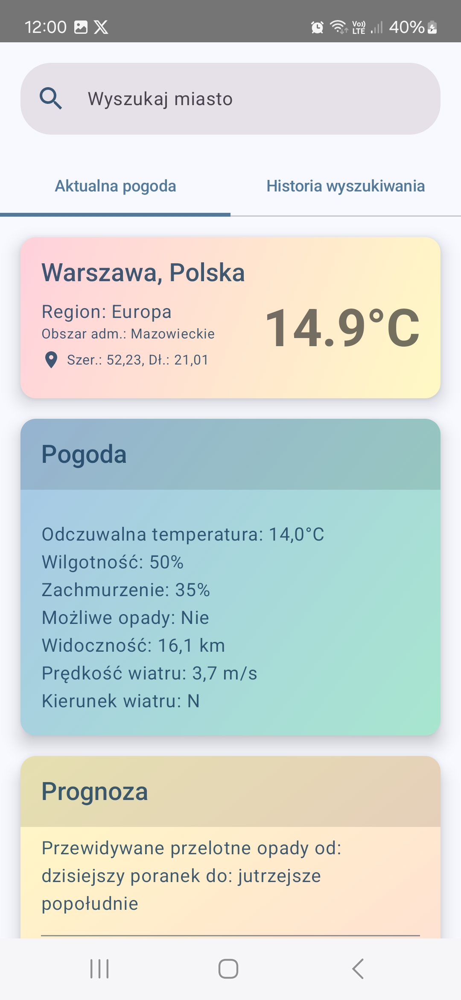
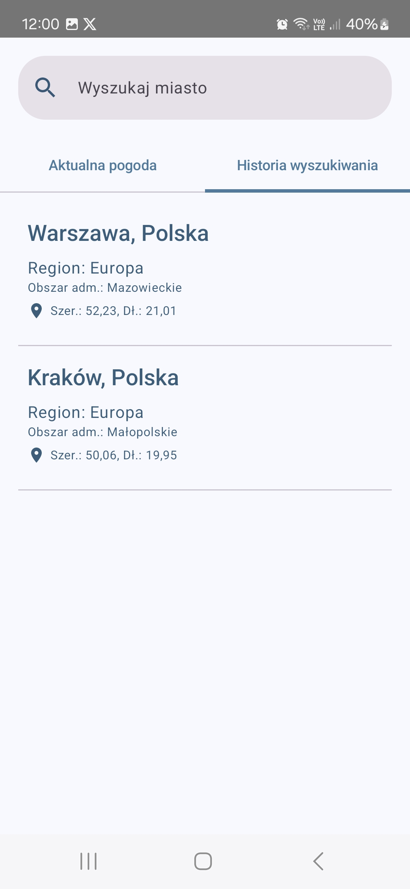

# MyWeather

## 1. Opis projektu

Aplikacja MyWeather służy do wyszukiwania i pobierania danych pogodowych. Realizuje ona założenia MVP (Minimum Valuable Product) dla tego typu aplikacji pogodowych.
Jako źródło danych używa darmowego API dostarczanego przez serwis AccuWeather.

|  |  |
| --- | --- |

## 2. Zaimplementowane wymagane funkcjonalności:

- wyszukiwanie miasta
- prezentacja listy wyszukiwanych miast z możliwością wyboru
- pobranie aktualnych danych pogodowych dla wybranego miasta
- prezentacja danych miasta oraz jego aktualnych warunków pogodowych wg. specyfikacji (temp. aktualna, stan zachmurzenia, możliwość opadów, wilgotność
- walidacja pola wyszukiwarki wg. wymagań funkcjonalnych: nazwa miejscowości nie może zawierać cyfr ani znaków specjalnych, obsługa polskich znaków, użycie wyrażenia regularnego
- prezentacja aktualnej temperatury przy pomocy koloru rezprezentującego gorącą, umiarkowaną i niską temperaturę wg. wymagań

## 3. Zaimplementowane dodatkowe funkcjonalności

- pobieranie 5-dniowej prognozy pogody dla wybranego miasta i prezentacja w postaci tabeli z podziałem na dni
- prezentacja dodatkowych szczegółowych danych dla aktualnej pogody jak np. prędkość i kierunek wiatru, odczuwalna temperatura czy widoczność
- zapisywanie wybranych miast w lokalnej bazie danych
- prezentacja listy zapisanych miast
- pobieranie pogody i prognozy dla miasta wybranego z listy zapisanych miast
- obsługa tematów kolorystycznych dla ustawionego w urządzeniu mobilnym trybu dziennego lub nocnego
- obsługa wielojęzykowości (i18n), stworzono pliki dla języka polskiego i angielskiego (default)

## 4. Architektura aplikacji

### 4.1 Clean Architecture

Zastosowano założenia **Clean Architecture** zakładające podział aplikacji na warstwy: domenową, danych oraz prezentacji.

Celem tego podejścia jest:
- łatwa w utrzymaniu i klarowna struktura projektu
- podział na moduły, pozwalający na niezależny development, oraz szybszą kompilację kodu
- enkapsulacja logiki biznesowej
- separacja zależności pomiędzy warstwami: warstwy zewnętrzne zależą od wewnętrznych, implementacje konkretne od abstrakcyjnych
- skalowalność
- łatwiejsze testowanie

Zastosowano **Dependency Injection** celem konfiguracji i instancjonowania obiektów oraz dostarczania zależności do wyższych warstw.

### 4.2 Modularyzacja projektu

Aplikację podzielono na następujące moduły (od warstwy najniższej/wewnętrznej):

- **domain** - moduł definiujący encje (entities) modelu danych domenowych (domain model) oraz logiki biznesowej: przypadków użycia (use cases) i interfejsu repozytorium
- **data** - moduł realizujący dostęp do danych, zawierający implementację DTO (data transfer objects) oraz repozytorium, pobieranie danych z API oraz zapis/odczyt do lokalnej bazy danych przy pomocy DAO (data access objects). Warstwa ta też realizuje translację obiektów z bazy danych oraz api (JSON) na obiekty modelu domenowego
- **common** - moduł pomocniczy zawierający np. funckje walidacji danych
- **presentation** - moduł zawierający interfejs użytkownika (UI), temat kolorystyczny (theme) i wygląd poszczególnych ekranów oraz kotrolek, a także view model
- **app** - moduł stanowiący tzw. punkt wejścia do aplikacji (entry point) wywołujący główna aktywność (MainActivity)

### 4.3 Architektura w warstwie prezentacji

W wartwie prezentacji zastosowano wzorzec architektoniczny **MVI** (Model - View - Intent), dzięki któremu możliwe jest:
- zarządzanie stanem
- niezależność komponentów
- odtwarzalność stanu i przebiegu procesów
- jednokierunkowa komunikacja
- łatwiejszy debbuging i testowanie

ViewModel - zachowuje i wystawia stan (State) widokom. Intecje (Intent) - definiują interakcje użytkownika.
Widok (View) aktualizowany jest w oparciu o stan w ViewModelu, który jest tzw. "jedynym źródłem prawdy".

## 5. Zastosowane frameworki i biblioteki

Zastosowanym językiem programowania jest **Kotlin** w wersji **2.0.20**.

- **Hilt 2.51** - biblioteka do realizacji wstrzykiwania zależności
- **Retrofit 2.11** - framework do realizacji komunikacji sieciowej z API REST
- **Room 2.6.1** - framework ORM do obsługi lokalnych operacji bazodanowych
- **Coroutines 1.9** - wbudowana w język Kotlin biblioteka do realizacji przetwarzania współbieżnego operacji
- **Compose 2024.09.02** - biblioteka do deklaratywnego budowania interfejsu użytkownika
- **Moshi 1.15.1** - biblioteka pomagajaca parsowanie danych JSON

Szczegóły znajdują się w pliku **lib.versions.toml**.

## 6. API AccuWeather

Do realizacji projektu wybrano API AccuWeather ze względu na prostotę oraz czytelność dokumentacji. Endpointy tego API wprost realizują założenia projektowe aplikacji.

Użyte zasoby:

**Locations API**
- `GET locations/v1/cities/search - do wyszukiwania miast`

**Forecast API**
- `GET forecasts/v1/daily/5day/{cityKey} - do pobrania prognozy 5-dniowej dla danego miasta`

**Current Conditions API**
- `GET currentconditions/v1/{cityKey} - do pobrania aktualnych warunków pogodowych dla danego miasta`

Szczegółowa dokumentacja: https://developer.accuweather.com/apis

## 7. Konfiguracja i kompilacja projektu

- Projekt został skonfigurowany do kompilacji z Android SDK API 34.
- Minimalne API urządzenia: 26 (Android 8)
- Android Studio: 2024.1.2 Patch 1
- OpenJDK 17.0.11
- Gradle 8.7

Aby skompilować projekt wymagany jest własny klucz do API AccuWeather:
https://developer.accuweather.com/user/me/apps

Klucz należy umieścić w pliku **local.properties** który nie jest przechowywany w repozytorium.
Do powyższego pliku należy dodać linię:

`ACCUWEATHER_API_KEY=xxxxxxxxxxxxxxxxxxxxxxxxxxxxx`

**UWAGA:** W darmowym pakiecie dostępu możliwe jest wykonanie 50 requestów do API / dzień

## 8. Testy jednostkowe ###

- Zaimplementowano testy jednostkowe w module **data** oraz **common** - do sprawdzenia poprawności działania logiki binzesowej i warstwy danych. Przetestowano podstawowe przypadki użycia. Pokrywają one również warstę domenową.
- Nie zaimplementowano testów jednostkowych i UI dla warstwy **presentation** z uwagi na ograniczenia czasowe

## 9. Dalszy rozwój aplikacji ###

Aplikacja jest gotowa do dalszego rozwoju. Proponowane dalsze funkcjonalności które są poza zakresem wymagań:
- wczytywanie z lokalnej DB ostatnich danych ostatnio wybranego miasta zaraz po starcie aplikacji
- cache'owanie danych: zapis aktualnej pogody i prognozy dla danego miasta w danym dniu do lokalnej DB, aby zminimalizować liczbę wywołań API
- ekran konfiguracji: wybór jednostek: metryczne / imperialne, język prognozy (parametry obecnie "zahardcodowane" w definicji serwisu) itp.
- implementacja kolejnych funkcjonalności udostępnionych w API AccuWeather, np. szczegółowa prognoza godzinowa czy na większą liczbę dni (dane dostępne w pakiecie płatnym)
- zarządzanie listą zapamiętanych miast (np. możliwość usunięcia), jest to już wspierane w logice bzinesowej

Projekt należy przygotować do wersji produkcyjnej i wdrożenia. Do rozważenia zastosowanie CI/CD do budowania aplikacji (np. GitLab pipelines).
